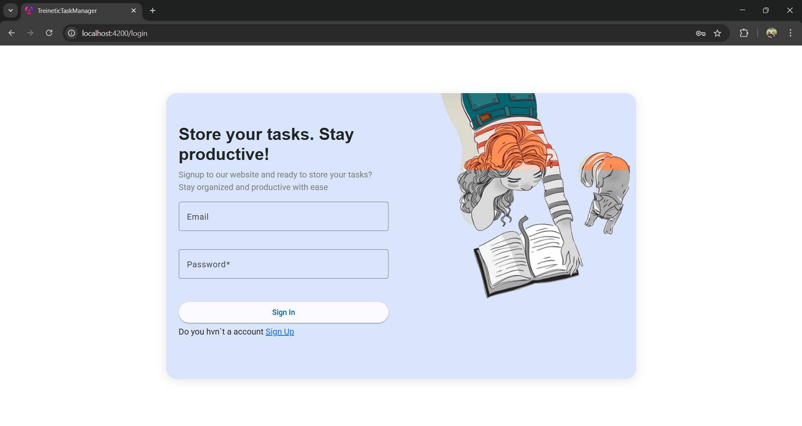
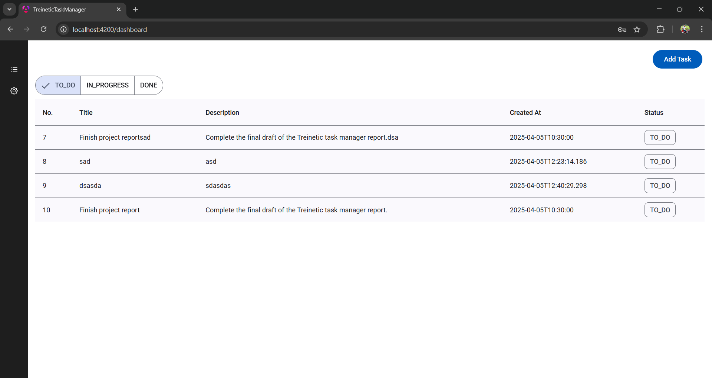
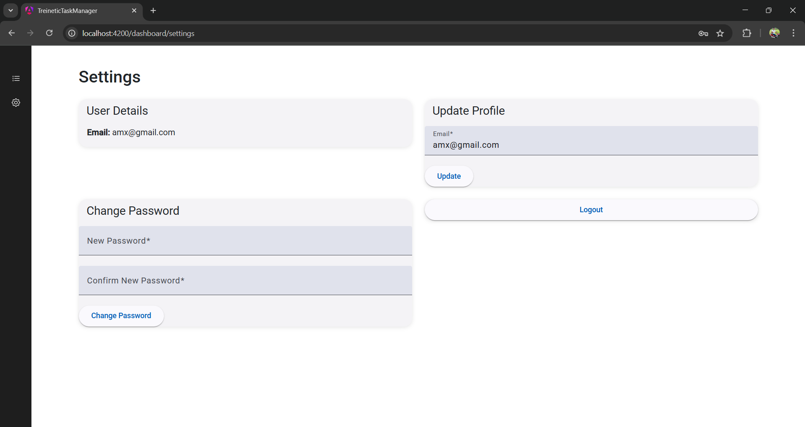

# 📝 Task Manager Application

A full-stack Task Manager application built with Angular for the frontend, Spring Boot for the backend, MySQL for the database, and Docker for containerization.

---

## 🚀 Project Structure

- **Frontend**: Angular
- **Backend**: Spring Boot (Java)
- **Database**: MySQL
- **Containerization**: Docker & Docker Compose

---

## 📸 Screenshots

| Login Page | Main Task Page | Settings Page |
|------------|----------------|----------------|
|  |  |  |

> 📝 Add your screenshots in the `/screenshots` folder and replace the above paths.

---

## 🛠️ Tech Stack

**Frontend**:
- Angular
- Angular Material / Bootstrap
- RxJS
- Forms & Routing

**Backend**:
- Spring Boot
- Spring Data JPA (Hibernate)
- RESTful API
- Security (JWT)

**Database**:
- MySQL

**Dev Tools**:
- IntelliJ IDEA / Webstrom
- Postman
- Docker
